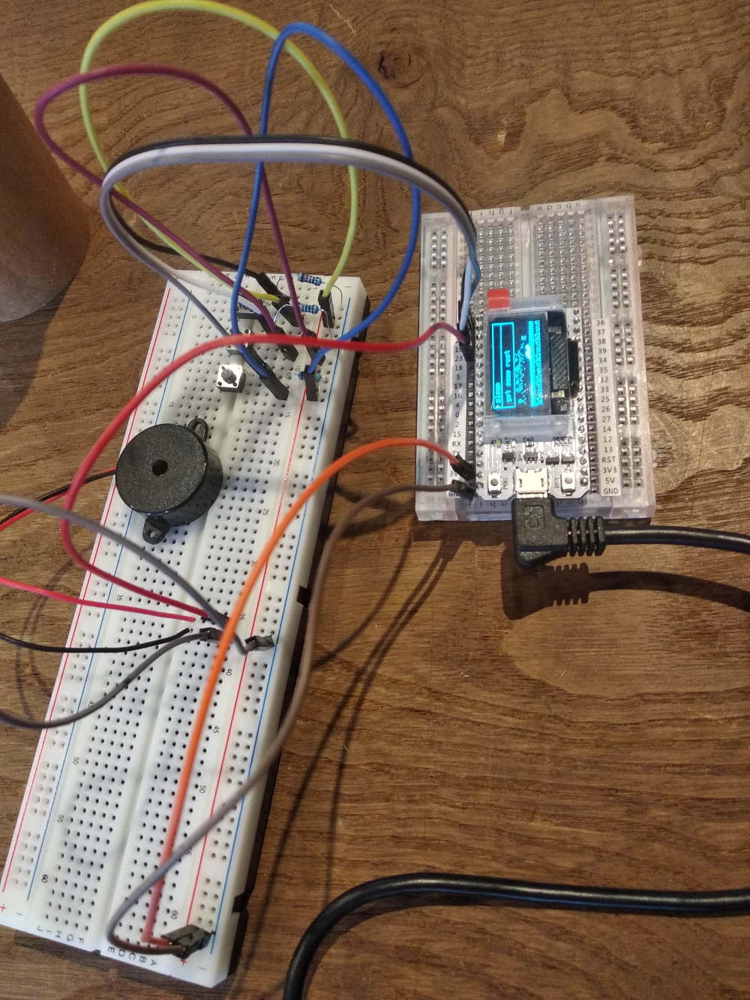

# Tamaguino for Heltec WifiKit32

Modifications to run Tamaguino on the ESP32 based [WIFI Kit 32](http://www.heltec.cn/project/wifi-kit-32/?lang=en) from Heltec.  The core math functions for ESP32 are a little different from the stock Arduino, while some functions are missing entirely (such as `tone` and `noTone`).

It would be fun to add a web interface to play with the dino...  coming soon?


## Wiring interface

No changes to the wiring except for the pin numbers, although this project assumes that resistors are tied to the switches (as the original project).

```
const int button1Pin = 21;
const int button2Pin = 22; 
const int button3Pin = 19; 
const int soundPin = 23; 
```



